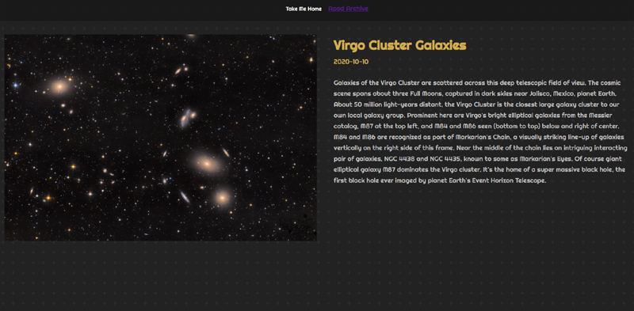

# Astronomy Picture of the Day in React

APOD has been one of my favorite sites for over a decade.  I thought it would be cool to have my own APOD site and learn about React.

## Deployed Heroku Link

https://macs-nasa-apod.herokuapp.com/  Go check out the App!

### Image of Heroku Site

## YouTube Tutorial

Great video showing how to create a nasa APOD React site using an api key from nasa and how to call it using the basic principles of React.

https://youtu.be/H1nENYv-r_w